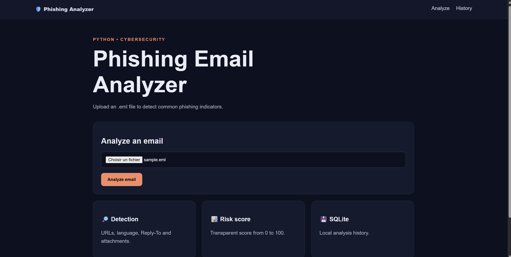
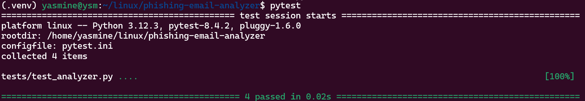

# 🛡️ Phishing Email Analyzer

Outil de cybersécurité développé en Python permettant d'analyser des fichiers `.eml` et de détecter des indicateurs courants de phishing.

## 📸 Démonstration

### Page d'accueil



### Résultat de l'analyse d'un email de phishing


L'analyseur a détecté **13 indicateurs suspects** et attribué un **score de risque critique de 100/100**.

### Historique des analyses


Les analyses précédentes sont enregistrées localement à l'aide de **SQLite**.

### Tests automatisés



Le projet comprend des **tests automatisés** permettant de vérifier la logique d'analyse des emails.

## ✨ Fonctionnalités

- Parsing des fichiers `.eml`
- Détection de mots-clés suspects
- Analyse des URLs
- Détection des incohérences entre `Reply-To` et l'expéditeur
- Analyse des pièces jointes
- Calcul d'un score de risque de 0 à 100
- Niveaux de risque : `LOW`, `MEDIUM`, `HIGH`, `CRITICAL`
- Historique des analyses avec SQLite
- Interface web avec Flask
- Tests automatisés avec Pytest

## 🛠️ Technologies

- Python 3
- Flask
- SQLite
- Pytest
- Expressions régulières (Regex)
- Linux / WSL
- Git / GitHub

## ⚙️ Fonctionnement

1. L'utilisateur importe un fichier `.eml`.
2. Les en-têtes et le contenu de l'email sont analysés.
3. Les URLs, mots-clés, pièces jointes et informations sur l'expéditeur sont examinés.
4. Les indicateurs suspects sont identifiés.
5. Un score de risque est calculé.
6. Le résultat est affiché via l'interface Flask.
7. L'analyse est enregistrée dans une base de données SQLite.

## 🧪 Tests

Pour exécuter les tests :

```bash
pytest
